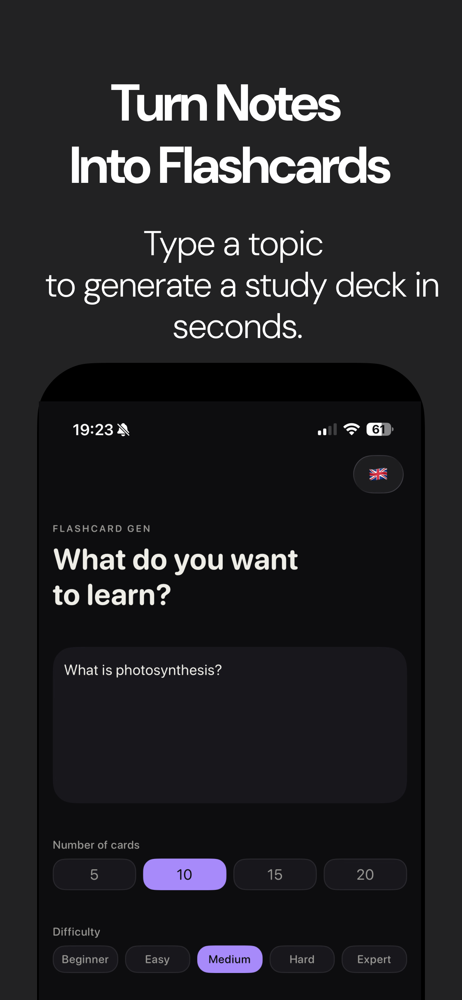
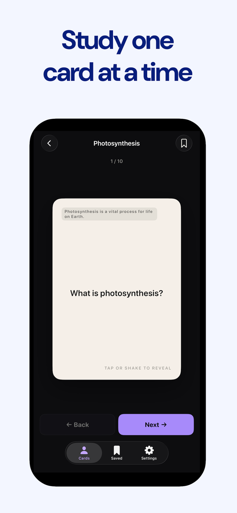
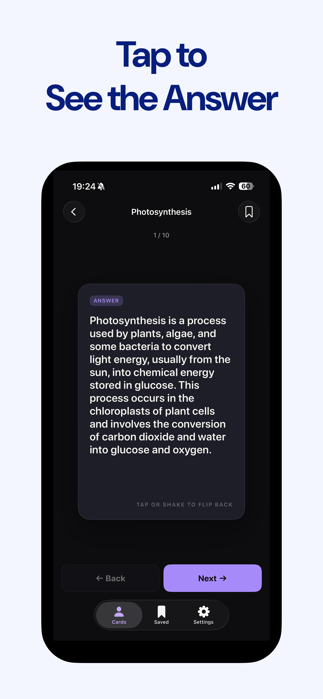
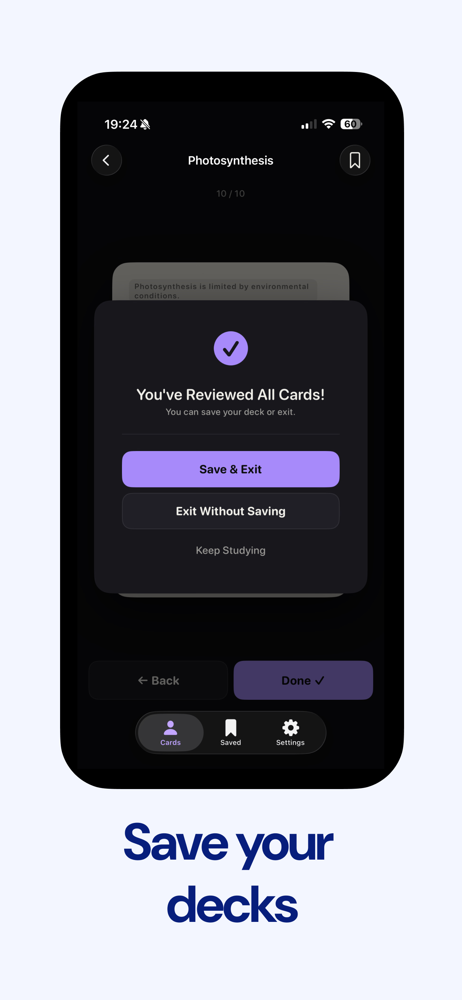
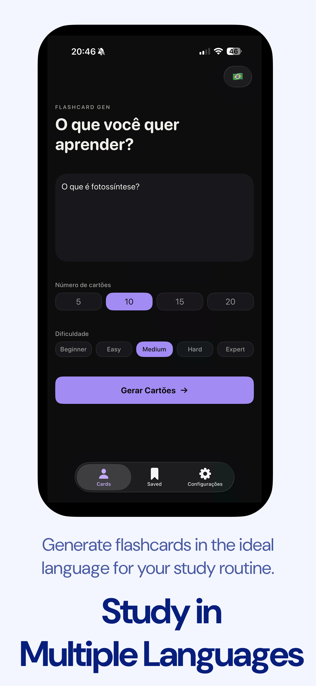

  <section class="marketing-hero" aria-labelledby="marketing-title">
    
FlipNote GEN

    <h1 id="marketing-title" class="marketing-title">Turn Notes Into Flashcards</h1>
    
Type a topic to generate a study deck in seconds.

    
  </section>

  <section class="marketing-section">
    

      

        <h2>Study one card at a time</h2>
        
Move through a focused deck with a clean, tactile flashcard flow built for repetition and recall.

        

          <strong>Simple review flow</strong>
          Each generated card keeps attention on one question before revealing the answer.
        

      

      

        
      

    

  </section>

  <section class="marketing-section">
    

      

        <h2>Tap to See the Answer</h2>
        
Reveal concise explanations when you are ready, then keep moving through the deck.

        

          <strong>Built for active recall</strong>
          Try the answer first, then flip the card to check the generated explanation.
        

      

      

        
      

    

  </section>

  <section class="marketing-section">
    

      

        <h2>Save your decks</h2>
        
Keep useful study sessions and return to them whenever you want to review.

        

          <strong>Review now, revisit later</strong>
          Save completed decks so your best study material stays available.
        

      

      

        
      

    

  </section>

  <section class="marketing-section">
    

      

        <h2>Study in Multiple Languages</h2>
        
Generate flashcards in the ideal language for your study routine.

        

          <strong>Flexible study material</strong>
          Create decks for classes, exams, and personal learning across supported languages.
        

      

      

        
      

    

  </section>

  <section class="closing">
    <h2>Flashcards from any topic, ready when you are.</h2>
    
FlipNote GEN reduces the gap between having notes and actually studying them.

    

      Coming soon on the App Store
      <a class="cta secondary" href="./privacy-policy.html">Privacy Policy</a>
    

  </section>

